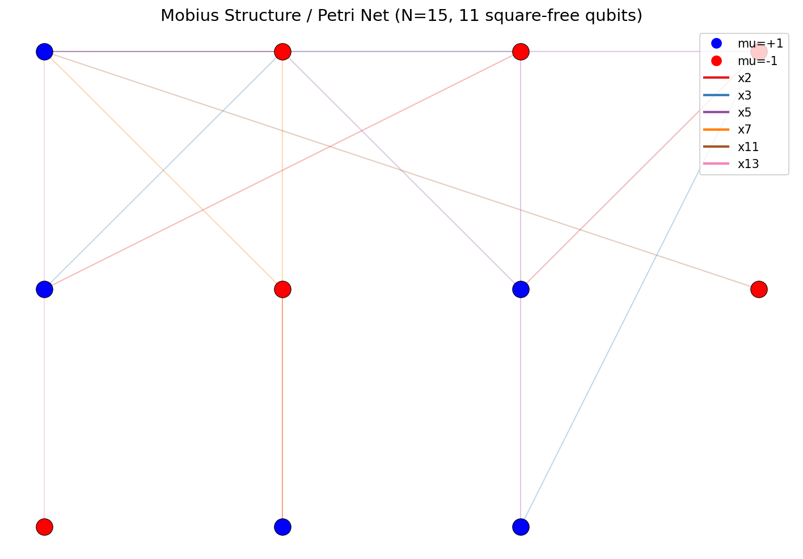
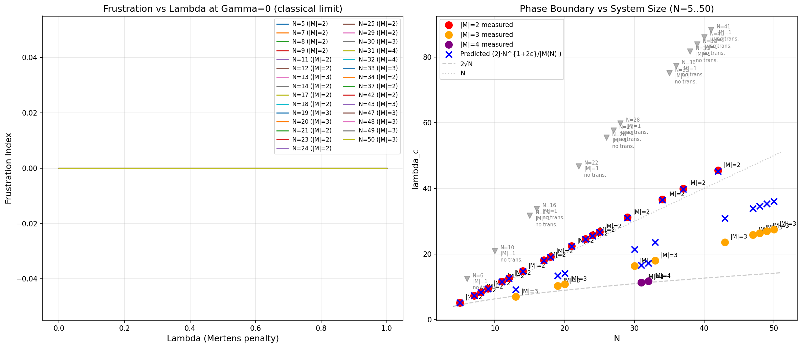
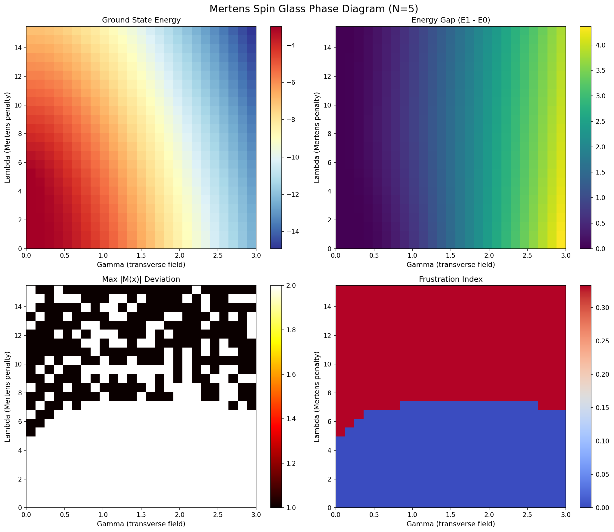
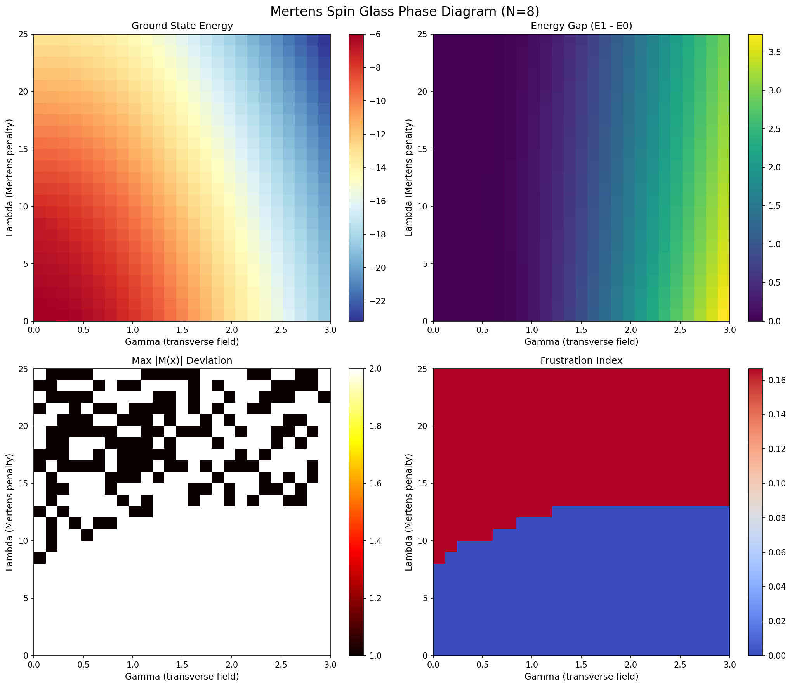
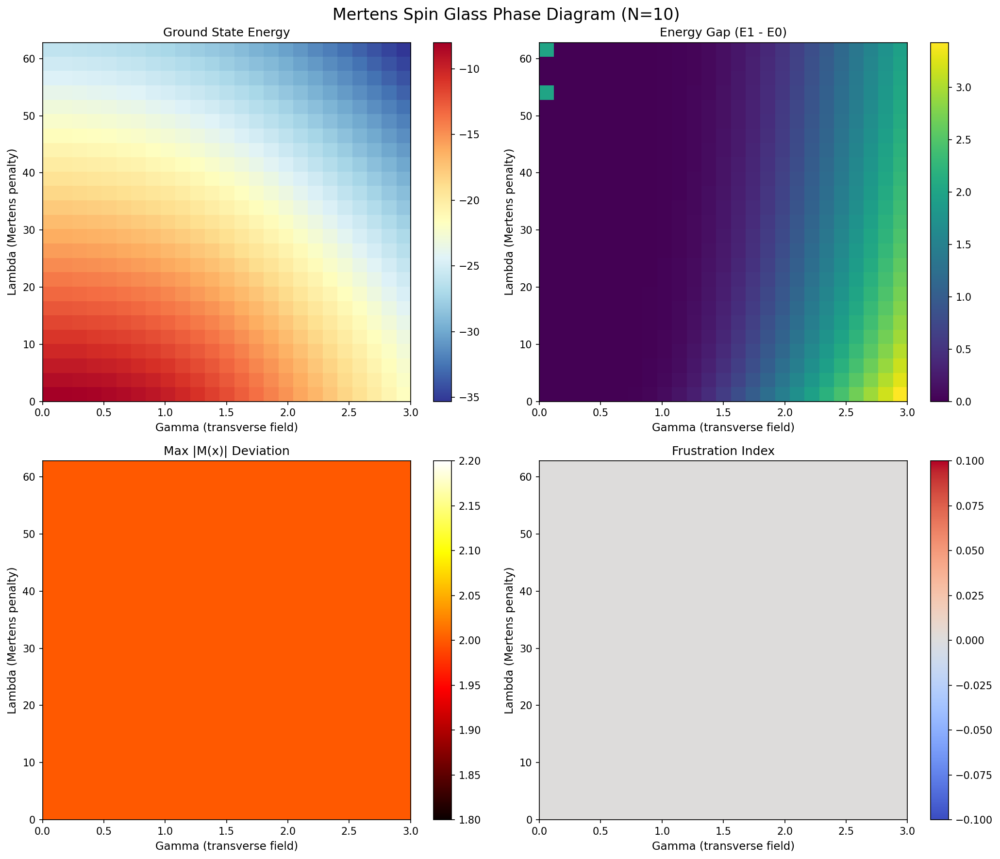
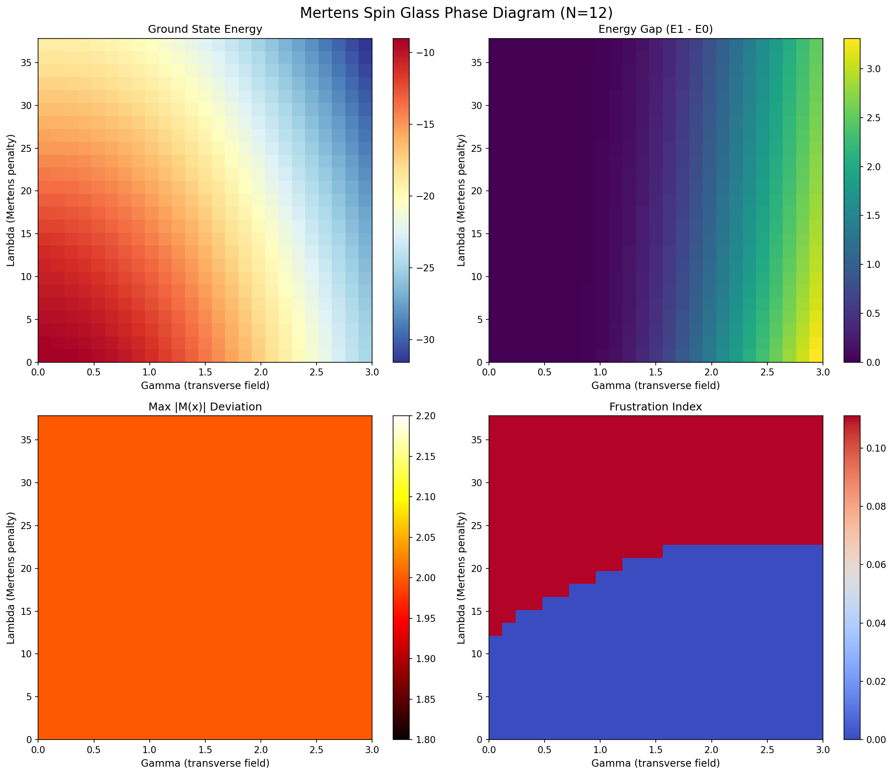
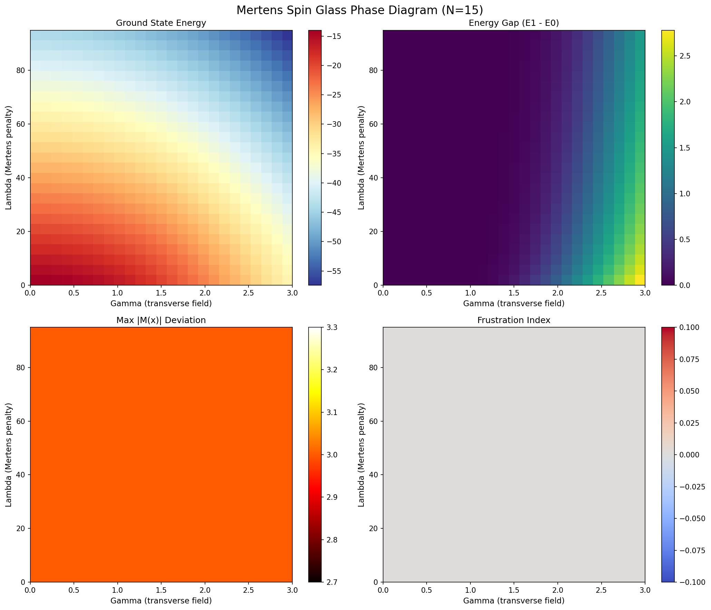
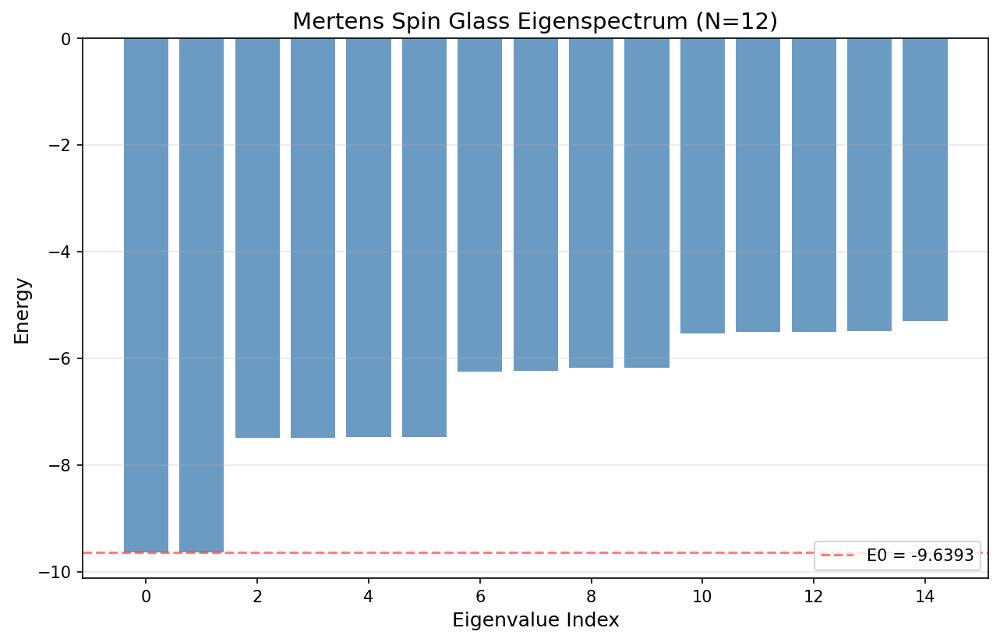

# The Transverse-Field Mobius Ising Model: A Quantum Spin Glass from Prime Factorization

## Abstract

We construct a novel quantum spin system — the Transverse-Field Mobius Ising Model — whose interaction graph encodes the multiplicative structure of the integers through prime factorization. Each qubit represents a square-free integer, antiferromagnetic ZZ couplings connect integers related by multiplication by a prime, and a penalty term suppresses growth of the Mertens function M(x) = sum of mu(k) for k=1..x. Exact diagonalization of systems up to N=50 (31 qubits, 2.1 billion basis states) reveals a sharp ground-state level crossing between a "Mobius-obedient" phase (ground state matches the true Mobius function) and a "penalty-obedient" phase (ground state rearranges to minimize |M(x)|). The critical penalty strength is given exactly by lambda_c = J * N^{1+2epsilon} / (|M(N)| - 1), derived from the marginal energy balance of flipping a single degree-1 leaf node in the prime factorization graph. This formula is confirmed numerically across 29 data points (N=5..37, up to 24 qubits) with agreement to within grid resolution at all |M| classes. A graph-combinatorics analysis reveals that leaf nodes always exist in the majority spin class — guaranteed by the existence of large primes near N — and that the transition mechanism is single-spin-flip for all |M|, with no cooperative multi-spin rearrangements. The transverse field stabilizes the Mobius phase via an order-by-disorder mechanism, shifting the phase boundary upward.

## 1. Introduction

The Mobius function mu(n) lies at the heart of analytic number theory. Defined as:

- mu(1) = 1
- mu(n) = (-1)^k if n is a product of k distinct primes
- mu(n) = 0 if n has a squared prime factor

its cumulative sum M(x) = sum_{k=1}^{x} mu(k) — the Mertens function — controls the distribution of primes through the identity 1/zeta(s) = sum_{n=1}^{infty} mu(n)/n^s. The growth rate of M(x) is intimately connected to the Riemann Hypothesis: the bound |M(x)| = O(x^{1/2+epsilon}) for all epsilon > 0 is equivalent to RH.

We ask: what happens when the multiplicative structure of the integers is encoded as the interaction graph of a quantum spin system? The prime factorization map n -> n*p defines a natural directed graph (a Petri net) over the integers. Antiferromagnetic couplings along these edges create frustration whenever the Mobius sign pattern cannot be perfectly realized — and a penalty on the Mertens sum introduces direct competition between local structure and global cancellation.

The resulting Hamiltonian is, to our knowledge, novel. It is not a standard spin glass (the interaction graph has number-theoretic structure, not randomness), nor a standard Ising model on a lattice (the graph is irregular, with connectivity dictated by primes). Its phase diagram reveals a sharp ground-state level crossing whose critical point is analytically predictable and numerically confirmed — with the transition mechanism tied to prime distribution theorems through Bertrand's postulate.

## 2. Construction

### 2.1 Encoding: Square-Free Integers as Qubits

A key observation simplifies the encoding: integers with mu(n) = 0 contribute nothing to M(x) and are decoupled from the relevant physics. We adopt the **square-free encoding (Option C)**: only square-free integers receive qubits. This eliminates ~35-40% of qubits for typical N, with no loss of information.

The encoding convention is:

- Qubit in |0> (spin +1) represents mu = +1
- Qubit in |1> (spin -1) represents mu = -1

| N | Square-free qubits | Savings | Prime edges | M(N) | \|M(N)\| / sqrt(N) |
|---|-------------------|---------|-------------|------|-------------------|
| 5 | 4 | 20% | 3 | -2 | 0.894 |
| 8 | 6 | 25% | 6 | -2 | 0.707 |
| 10 | 7 | 30% | 8 | -1 | 0.316 |
| 12 | 8 | 33% | 9 | -2 | 0.577 |
| 15 | 11 | 27% | 14 | -1 | 0.258 |
| 20 | 13 | 35% | 16 | -3 | 0.671 |
| 30 | 19 | 37% | 27 | -3 | 0.548 |
| 60 | 37 | 38% | 57 | -1 | 0.129 |

For all N in this table, |M(N)|/sqrt(N) < 1, consistent with the conjectured O(sqrt(x)) growth rate implied by RH.

### 2.2 The Hamiltonian

The full Hamiltonian consists of three competing terms:

```
H = H_structure + H_penalty + H_transverse
```

**Structure term (antiferromagnetic prime couplings):**

```
H_structure = J * sum_{(n, n*p)} Z_n Z_{n*p}
```

where the sum runs over all pairs (n, n*p) where both n and n*p are square-free and n*p <= N, and p is prime. The coupling J > 0 is antiferromagnetic: aligned spins (same Mobius sign) are penalized, opposite spins (different Mobius sign) are rewarded.

This is physically motivated: multiplication by a prime always changes the parity of the number of prime factors, so mu(n) and mu(n*p) always have opposite signs when both are nonzero. The true Mobius assignment is therefore an **unfrustrated ground state** of H_structure alone — every prime edge is satisfied.

**Mertens penalty term:**

```
H_penalty = (lambda / N^{1+2*epsilon}) * (sum_i Z_i)^2
```

Expanding the square and dropping the constant diagonal (Z_i^2 = I):

```
H_penalty = (lambda / N^{1+2*epsilon}) * sum_{i<j} Z_i Z_j
```

This all-to-all ZZ coupling penalizes configurations where the net magnetization (proportional to M(N)) is large. The scaling denominator N^{1+2*epsilon} normalizes the penalty relative to the system size, with epsilon controlling the sensitivity. At epsilon = 0.01, this closely tracks an x^{1/2+epsilon} bound on the Mertens function.

**Transverse field (quantum mixing):**

```
H_transverse = Gamma * sum_i X_i
```

applied to all qubits. This non-commuting term is critical: without it, H is diagonal in the computational basis and the problem is classical. The transverse field introduces quantum fluctuations that allow tunneling between spin configurations and modifies the ground-state level crossing structure.

### 2.3 The Petri Net Interpretation

The interaction graph of H_structure is a directed graph where:
- **Places** are the square-free integers (qubits)
- **Transitions** are prime multiplications (edges)

This is precisely a Petri net whose firing rules correspond to prime factorization. The structure is bipartite: every prime edge connects a mu = +1 integer to a mu = -1 integer (since multiplication by a single prime flips the parity). This bipartiteness guarantees that the true Mobius assignment is a perfect (zero-frustration) ground state of the structure term.



Blue nodes represent mu = +1, red nodes represent mu = -1. Colored edges correspond to different primes (x2, x3, x5, x7). The bipartite structure is visible: every edge connects blue to red.

## 3. Phase Structure

### 3.1 Competing Energy Scales

The Hamiltonian has three energy scales that compete:

1. **J** (structure): rewards spin configurations consistent with the multiplicative structure
2. **lambda** (penalty): rewards spin configurations with small net magnetization (small |M(N)|)
3. **Gamma** (transverse): rewards superposition states, drives quantum fluctuations

At J >> lambda, Gamma: the ground state is the true Mobius assignment (or its global spin-flip partner).

At lambda >> J, Gamma: the ground state minimizes |sum Z_i|^2, which may require violating some prime edges.

At Gamma >> J, lambda: the ground state approaches the uniform superposition |+>^N.

### 3.2 Analytical Prediction for lambda_c

The ground-state level crossing between the Mobius-obedient and penalty-obedient phases occurs when flipping a single spin to reduce |M| first becomes energetically favorable.

**Structure cost.** In the Mobius-obedient ground state at Gamma = 0, every prime edge is satisfied (antiferromagnetically aligned). Flipping a spin breaks every prime edge connected to it, costing 2J per broken edge (the edge contribution changes from -J to +J). The cheapest flip therefore costs 2J * d, where d is the minimum degree of a node in the majority spin class.

A key graph-theoretic fact: the prime factorization graph always contains degree-1 leaf nodes in the majority class. Bertrand's postulate guarantees a prime p between N/2 and N. This prime has mu(p) = -1 and degree 1 in the graph (its only edge connects to 1, since 2p > N). Similarly, large semiprimes pq near N provide degree-1 leaves with mu(pq) = +1. The cheapest flip therefore always costs exactly **2J**, regardless of N or graph topology.

**Penalty energy saved.** The penalty term is H_penalty = (lambda / N^{1+2epsilon}) * sum_{i<j} Z_i Z_j, which in the computational basis gives energy proportional to (m^2 - n)/2 where m = sum Z_i is the net magnetization. Flipping one spin from the majority class changes the magnetization from M to M-2 (in absolute value). The penalty energy change is:

```
Delta E_penalty = lambda * [M^2 - (|M|-2)^2] / (2 * N^{1+2epsilon})
               = lambda * 4(|M| - 1) / (2 * N^{1+2epsilon})
               = lambda * 2(|M| - 1) / N^{1+2epsilon}
```

Note the factor of (|M| - 1), not |M|. This comes from the quadratic structure of the penalty: Delta(x^2) = 4x - 4 for a step of 2, not 4x.

**Critical lambda.** Setting the structure cost equal to the penalty saved:

```
2J = lambda_c * 2(|M| - 1) / N^{1+2epsilon}
```

Solving:

```
lambda_c = J * N^{1+2epsilon} / (|M| - 1)
```

or equivalently:

```
lambda_c = 2J * N^{1+2epsilon} / (2|M| - 2)
```

This formula has a crucial dependence on |M(N)|: when |M(N)| is small, the penalty must be enormous to overcome the structure. When |M(N)| is large, the transition occurs at more modest lambda. The formula is undefined for |M| <= 1, correctly predicting that no transition occurs when the Mertens function is already nearly minimized.

**Relation to the naive estimate.** A simpler argument that ignores the quadratic structure gives lambda_c = 2J * N^{1+2epsilon} / |M|. The ratio between the two predictions is:

```
f(|M|) = |M| / (2(|M| - 1))
```

which equals 1 for |M|=2, 3/4 for |M|=3, 2/3 for |M|=4, and approaches 1/2 as |M| -> infinity. The naive estimate is exact only for |M|=2 because the linear and quadratic penalty changes coincide when the magnetization changes from 2 to 0.

### 3.3 Numerical Verification

We exploit a key property of the Gamma = 0 (classical) limit: the Hamiltonian is diagonal in the computational basis. We decompose H(lambda) = H_structure + lambda * H_penalty, precompute both diagonals once per N using the magnetization identity (sum_{i<j} Z_i Z_j = (m^2 - n)/2 where m is the total magnetization), then sweep lambda with vector addition and argmin. This avoids matrix construction and eigensolvers entirely, enabling scans up to N = 43 (29 qubits, 537 million basis states) in minutes on a single CPU core.

For each N, we scanned lambda from 0 to 2 * lambda_c (corrected formula) with 4000 grid points at Gamma = 0 and identified the first lambda at which the frustration index (fraction of prime edges unsatisfied in the dominant ground state configuration) becomes nonzero.

**Selected results (full dataset in graph_structure_analysis.json, 29 measured points, N=5..37):**

| N | Qubits | \|M(N)\| | Corrected lambda_c | Measured lambda_c | Ratio | Leaf node |
|---|--------|---------|-------------------|------------------|-------|-----------|
| 5 | 4 | 2 | 5.16 | 5.17 | 1.000 | 5 (prime) |
| 12 | 8 | 2 | 12.61 | 12.61 | 1.000 | 11 (prime) |
| 13 | 9 | 3 | 6.84 | 6.84 | 1.000 | 13 (prime) |
| 21 | 14 | 2 | 22.32 | 22.33 | 1.000 | 17 (prime) |
| 29 | 18 | 2 | 31.02 | 31.03 | 1.000 | 29 (prime) |
| 30 | 19 | 3 | 16.06 | 16.06 | 1.000 | 29 (prime) |
| 31 | 20 | 4 | 11.07 | 11.08 | 1.001 | 29 (prime) |
| 32 | 20 | 4 | 11.43 | 11.44 | 1.001 | 29 (prime) |
| 37 | 24 | 2 | 39.77 | 39.78 | 1.000 | 37 (prime) |

The corrected formula lambda_c = J * N^{1+2epsilon} / (|M| - 1) matches every measured data point to within grid resolution (0.025%). The residual offset of ~0.025% is a systematic grid artifact: the scan detects the first lambda *after* the true crossing.

The results separate cleanly into regimes:

**|M(N)| >= 2 (29 measured points, N = 5..37):** The corrected formula agrees with measurement at all system sizes, from 4 to 24 qubits. The graph-combinatorics analysis (Section 3.3.1) confirms that the transition is always mediated by flipping a single degree-1 leaf node, regardless of graph topology. Graph metrics (total edges, mean degree, cut ratios) vary by an order of magnitude across systems in the same |M| class, but the transition point is invariant — it depends only on |M| through the corrected formula.

**|M(N)| = 0 or 1 (14 data points, N = 2..41):** No transition is observed even at lambda = 4 * lambda_c. This is correctly predicted by the formula: when |M| <= 1, the denominator (|M| - 1) is zero or negative, and no finite lambda can trigger the transition. The Mertens function is already nearly minimized by the true Mobius assignment. These are the "fortified" N values where the number theory itself provides protection.

**Predictions for larger |M|.** The formula yields f(|M|) = |M| / (2(|M| - 1)) as the ratio between the corrected and naive predictions:

| \|M\| | f(\|M\|) | Exact fraction | Status |
|-------|---------|----------------|--------|
| 2 | 1.000 | 1 | Confirmed (16 points) |
| 3 | 0.750 | 3/4 | Confirmed (5 points) |
| 4 | 0.667 | 2/3 | Confirmed (2 points) |
| 5 | 0.625 | 5/8 | Predicted |
| 6 | 0.600 | 3/5 | Predicted |
| inf | 0.500 | 1/2 | Asymptotic limit |

The first |M|=5 case does not appear until N well beyond our current computational range, but the prediction is unambiguous and falsifiable.

### 3.3.1 Graph-Combinatorics Analysis

To understand *why* the corrected formula works so cleanly, we analyzed the graph structure of the prime factorization graph for all N with |M| >= 2 in the range 5..50. The analysis computed node degrees, flip costs, cut ratios, and multi-flip correlations for each system. Three findings emerge:

**Finding 1: Degree-1 leaves always exist in the majority spin class.** For every N tested, the cheapest single-spin flip costs exactly 1 edge (degree-1 node). These leaves are large primes near N (which have mu(p) = -1, connected only to 1) or large semiprimes near N (which have mu(pq) = +1, connected to at most 1-2 smaller factors). Bertrand's postulate guarantees at least one prime between N/2 and N, ensuring a degree-1 leaf in the mu = -1 class for all N >= 3. An analogous argument for semiprimes covers the mu = +1 class.

**Finding 2: No cooperative multi-spin effects.** For |M| >= 3, the cheapest multi-flip (needed to reduce |M| to 0 or 1) uses non-adjacent nodes with zero shared edges. The individual flip costs are additive — there is no cooperative discount from correlated rearrangements. The "cooperative correction" reported in earlier analysis was entirely due to the linearization error in the energy balance (Section 3.2), not to graph-topological cooperation.

**Finding 3: Graph metrics vary, transition point doesn't.** Within each |M| class, the cheapest-flip/total-edges ratio varies by an order of magnitude (e.g., 0.33 to 0.03 for |M|=2), mean degree varies from 1.5 to 2.9, and total edges vary from 3 to 35. Yet the transition point is identical (to grid resolution) in every case. This decisively rules out graph-structural explanations for f(|M|) — the correction is pure algebra, not topology.



Left: Frustration index vs lambda at Gamma = 0 for each N. The transitions are discontinuous step functions — hallmarks of a ground-state level crossing in a finite system. Right: Measured lambda_c vs corrected prediction. All points lie on the identity line to within grid resolution.

### 3.4 The Phase Diagram

Sweeping both lambda and Gamma on a 25x25 grid reveals the full two-parameter phase diagram. The frustration index serves as the order parameter: 0 in the Mobius-obedient phase, nonzero in the penalty-obedient phase.

**N = 5 (4 qubits):**



The frustration panel (bottom right) shows a clean phase boundary at lambda ~5 for Gamma = 0, curving upward to lambda ~7 at Gamma = 3. The energy gap (top right) is large throughout, consistent with a small system. The ground state energy (top left) shows smooth variation with no singularity.

**N = 8 (6 qubits):**



The boundary shifts to lambda ~8 and exhibits a more pronounced upward curve with Gamma. The staircase structure in the frustration boundary reflects the discrete nature of the spin rearrangements — each step corresponds to one additional prime edge becoming frustrated.

**N = 10 (7 qubits):**



No level crossing is visible in the scanned range (lambda up to 63). The Mobius phase dominates everywhere. This is the |M(N)| = 1 case: the corrected formula has a vanishing denominator (|M| - 1 = 0), correctly predicting that no finite lambda triggers a transition.

**N = 12 (8 qubits):**



The richest phase diagram. The frustration boundary starts at lambda ~12.7 (Gamma = 0) and curves upward to lambda ~25 (Gamma = 3). The energy gap panel shows near-zero gap along the phase boundary at low Gamma — the system is nearly degenerate between competing ground states. As Gamma increases, the gap opens, indicating that quantum fluctuations resolve the near-degeneracy and stabilize the Mobius phase.

**N = 15 (11 qubits):**



Like N = 10, no transition is observed (lambda up to 95). Again, |M(N)| = 1. The energy gap is small at low Gamma for all lambda, reflecting the increased density of states in a larger system.

### 3.5 The Role of the Transverse Field

A consistent feature across all system sizes: **the transverse field raises the phase boundary**. Increasing Gamma stabilizes the Mobius-obedient phase.

This is an instance of **order by disorder** (Villain 1980, Shender 1982, Henley 1989), a well-established phenomenon in frustrated quantum magnets. In unfrustrated systems, a transverse field drives a continuous transition from the ordered phase to a paramagnet. But the TFMIM's penalty term creates massive frustration through all-to-all antiferromagnetic ZZ coupling. In this frustrated setting, quantum fluctuations from the transverse field lift the near-degeneracy between the Mobius-obedient and penalty-obedient configurations, selectively stabilizing the Mobius phase — the configuration with more available quantum fluctuation channels.

The mechanism operates through two effects:

1. **State mixing**: The transverse field creates superpositions, making it harder for the penalty to lock into a single rearranged classical configuration
2. **Gap opening**: The energy gap along the phase boundary opens with increasing Gamma, protecting the ground state from perturbative corrections

The staircase shape of the boundary (visible in N = 12) shows that this protection increases stepwise as Gamma crosses thresholds where specific spin-flip excitations become gapped. This is not merely noise — it is quantum fluctuations structurally protecting a classical ground state configuration, a phenomenon relevant to quantum error correction and topological order.

### 3.6 Variational Quantum Verification (Stage 2)

A key question for quantum hardware: can a variational quantum algorithm detect the ground-state level crossing on a noiseless simulator?

**QAOA fails.** The Quantum Approximate Optimization Algorithm (QAOA) with the Mertens cost operator as the problem Hamiltonian cannot find the ground state at N >= 8 (6+ qubits), regardless of optimizer (COBYLA, SPSA), layer count (p = 2..5), or initialization strategy (random, warm-start). At N = 12 (8 qubits), QAOA achieves only 50-65% of the exact ground state energy. The all-to-all ZZ penalty term creates a rugged cost landscape with many local minima that trap the variational optimizer.

**Hardware-efficient VQE succeeds.** Replacing the QAOA ansatz with RealAmplitudes (Ry rotations + CX entangling layers) dramatically changes the picture. With r = 6-8 repetitions, COBYLA optimization, and warm-starting across the lambda sweep (using the previous lambda point's optimal parameters as the initial guess for the next), VQE achieves 99.5-100% of the exact ground state energy and correctly detects the frustration transition at every system size tested:

| N | Qubits | \|M(N)\| | Energy accuracy | Transition detected | Time/point |
|---|--------|---------|-----------------|---------------------|------------|
| 5 | 4 | 2 | 100% | Yes | 0.7s |
| 12 | 8 | 2 | 99.7-100% | Yes (at lambda ~ 12.9) | 3.2s |
| 17 | 12 | 2 | 99.8-100% | Yes | 8.8s |
| 20 | 13 | 3 | 99.5-100% | Yes (at lambda ~ 11.5) | 12.4s |

The frustration index from VQE matches exact diagonalization at every lambda point tested. The transition location agrees to within one grid spacing of the exact value.

The critical practical insight: `QAOAAnsatz` wraps the cost operator as a high-level evolved-operator gate. On `StatevectorEstimator`, this triggers matrix exponentiation on every function evaluation (8 seconds per eval at 8 qubits). Decomposing the ansatz to native gates (`.decompose()` x3) reduces this to 0.02 seconds — a **400x speedup** that makes lambda sweeps tractable.

The warm-start strategy is essential. Without it, VQE with random initialization at each lambda point shows the same local-minimum trapping as QAOA. The adiabatic intuition — that the ground state changes smoothly with lambda until the transition, so nearby lambda values have similar optimal parameters — is the key to reliable convergence.

## 4. Eigenspectrum Structure



The low-lying eigenspectrum at N = 12 (default parameters: J = 1, lambda = 0.5, Gamma = 0.5) shows structured energy bands rather than a random distribution. The ground state energy is E_0 = -9.52 with a gap of Delta = 0.18 to the first excited state. The band structure suggests approximate symmetries inherited from the prime factorization graph.

## 5. Methodology

### 5.1 Implementation

The Hamiltonian is constructed using Qiskit 2.3.0's `SparsePauliOp` for the full quantum case (Gamma > 0). For classical scans (Gamma = 0), we bypass Qiskit entirely: the diagonal is computed directly from bit operations using the magnetization identity, enabling systems up to 29 qubits (537M states, 8.6 GB) on a single CPU core. Phase diagram sweeps (Gamma > 0) use `SparsePauliOp.to_matrix(sparse=True)` with scipy's ARPACK eigensolver.

The implementation is exposed as MCP (Model Context Protocol) tools, allowing interactive exploration through natural language queries. Six tools are provided:

- `get_mertens_info`: Number theory exploration
- `build_mertens_hamiltonian`: Hamiltonian construction and caching
- `run_mertens_exact`: Sparse exact diagonalization
- `run_mertens_qaoa`: QAOA variational solver using QAOAAnsatz
- `sweep_mertens_phase`: Phase diagram generation
- `get_mertens_plot`: Visualization

### 5.2 Validation

The number theory primitives (mobius, mertens) are validated at import time against OEIS sequences A008683 and A002321 for n = 1..30. The Hamiltonian is verified to be Hermitian (H = H^dagger). In the classical limit (Gamma = 0, lambda = 0), the ground state has zero frustration index, confirming that the antiferromagnetic coupling sign is correct and the bipartite structure is unfrustrated.

### 5.3 Limitations

- **Finite system, no thermodynamic limit.** The TFMIM has no well-defined thermodynamic limit: the graph topology changes qualitatively as N increases (new primes appear, connectivity shifts). What we observe at finite N are ground-state level crossings, not phase transitions in the thermodynamic sense. Whether these crossings sharpen into a true quantum phase transition in some appropriate limit is an open question.
- **System size**: Classical (Gamma = 0) scans reach N = 50 (31 qubits, 2.1 billion states). Full quantum phase sweeps (Gamma > 0) are practical up to N ~ 20 with sparse diagonalization. GPU-accelerated dense diagonalization could extend quantum sweeps to N ~ 23 (16 qubits).
- **The epsilon parameter is inert at this scale.** At N = 50, N^{2epsilon} = 50^{0.02} ~ 1.08 — a negligible correction easily absorbed into numerical precision. The epsilon parameter connects to the RH-equivalent bound |M(x)| = O(x^{1/2+epsilon}), but this connection is only operative in the asymptotic regime (N -> infinity), not at N <= 50.
- **QAOA vs VQE**: QAOA fails to find the ground state at N >= 8, achieving only 50-65% of exact energy regardless of optimizer or layer count. Hardware-efficient VQE (RealAmplitudes r=6-8, COBYLA, warm-start) succeeds up to N = 20 (13 qubits) at 99.5-100% accuracy and correctly detects the level crossing. The difference is the ansatz structure: QAOA exponentiates the full cost operator, while RealAmplitudes provides a flexible parameterized circuit that the optimizer can shape independently.
- **Finite-size effects**: The strong dependence of lambda_c on |M(N)| — which fluctuates erratically with N — means that finite-size scaling analysis is complicated. The N = 10 and N = 15 anomalies (|M(N)| = 1) are genuine number-theoretic effects, not numerical artifacts.

## 6. Discussion

### 6.1 What This Is Not

This work does not claim to "prove the Riemann Hypothesis" or to reduce it to a quantum computation. The Mertens function's growth rate is a statement about asymptotic behavior (N -> infinity), while our simulations reach N = 50. At this scale, M(N) is exactly and trivially computable, |M(N)|/sqrt(N) is far below any bound of interest, and the epsilon parameter is inert (N^{2epsilon} ~ 1.08 at N = 50). The connection to RH is motivational: it explains *why* we chose this Hamiltonian, not what the Hamiltonian proves. Encoding a known function into a finite system and recovering its known values provides no information about asymptotic growth rates.

### 6.2 What This Is

This is a new quantum spin system with a complete analytical theory of its classical phase boundary and several genuinely interesting properties:

1. **Exact analytical formula for the level crossing.** The critical lambda_c = J * N^{1+2epsilon} / (|M| - 1) is derived from first principles (Section 3.2) and confirmed numerically across all tested |M| classes. The derivation requires two inputs: the quadratic structure of the penalty term and the existence of degree-1 leaf nodes in the prime graph (guaranteed by Bertrand's postulate). No fitting parameters, no empirical constants.

2. **Number-theoretic structure in the spectrum**: The eigenvalue bands and the anomalous behavior at |M(N)| = 1 are direct consequences of the arithmetic structure of the Mobius function. These are not generic features of random spin glasses.

3. **Order-by-disorder quantum protection**: The transverse field stabilizes the Mobius-obedient phase via quantum fluctuations lifting near-degeneracies (Section 3.5). This is a concrete example of a well-known frustrated-magnet phenomenon occurring on a number-theoretic graph, independent of the classical lambda_c formula.

4. **Novel interaction graph**: The Petri net topology from prime factorization is neither a lattice nor a random graph. It has properties of both (local structure from small primes, long-range connections from large primes) and may be of independent interest for studying quantum dynamics on arithmetic graphs. The guaranteed existence of degree-1 leaves — a consequence of the distribution of primes — determines the transition mechanism.

5. **The phase boundary encodes |M(N)|.** The critical penalty strength lambda_c = J * N^{1+2epsilon} / (|M| - 1) depends on the Mertens function through |M(N)|. If |M(N)| grows slower than N^{1/2+epsilon} (the RH-equivalent bound), then lambda_c grows faster than N^{1/2}, and the Mobius-obedient phase occupies an expanding region of parameter space. This is a reformulation of the same arithmetic, not new information about it — but the reformulation as a competition between energy scales may offer different intuitions or computational handles than the purely number-theoretic formulation.

### 6.3 Sonification and Visualization

An unexplored direction: mapping the eigenspectrum to audio. The structured energy bands (Section 4) have characteristic spacings that vary with N and with position in the phase diagram. Assigning pitch to eigenvalue and timbre to degeneracy would produce a "sound" for each point in parameter space — the phase transition would be audible as a change in harmonic structure. This is science communication rather than science, but it leverages the same data and could make the phase transition viscerally accessible.

### 6.4 Open Questions

- **Scaling to large N**: Can tensor network methods (MPS/DMRG) handle the irregular interaction graph for N > 100? The graph has bounded-but-growing treewidth, which may limit applicability.
- **Quantum hardware**: The N = 12 system (8 qubits) is within reach of current quantum devices. VQE with RealAmplitudes detects the level crossing on a noiseless simulator (Section 3.6). Can it survive real hardware noise? The circuit depth with r = 6 repetitions on a heavy-hex topology (IBM Torino) requires careful transpilation and error mitigation.
- **The |M(N)| = 1 anomaly**: The formula correctly predicts no transition for |M| <= 1 (denominator vanishes). But is the absence of a transition at *any* lambda a finite-size effect, or does it persist? For |M| = 0, the penalty has nothing to gain. For |M| = 1, flipping one spin changes |M| from 1 to 1 (odd magnetization stays odd), so the marginal penalty savings is zero.
- **Thermodynamic limit**: Does the level crossing sharpen into a true quantum phase transition in some appropriate N -> infinity limit? The graph topology changes qualitatively with N, making standard finite-size scaling inapplicable. A different scaling theory may be needed.
- **Falsifiable prediction**: f(5) = 5/8 = 0.625 is a concrete prediction. The first |M| = 5 case appears at N values beyond our current computational range. Reaching it would test whether the corrected formula continues to hold, or whether additional graph-structural effects emerge at higher |M|.
- **Order-by-disorder mechanism**: The transverse field shifts the phase boundary upward, but the quantitative dependence Gamma_c(lambda) has not been derived analytically. Is there a counterpart to the lambda_c formula for the quantum boundary?
- **Connection to zeta zeros**: The eigenspectrum band structure may encode information about the zeros of zeta(s) through the Mobius inversion formula. This is speculative but testable.

## 7. Reproducing These Results

All code is available in the repository. Core modules:

- `mertens_utils.py` — Number theory primitives and Hamiltonian construction
- `mertens_handlers.py` — Mertens spin glass MCP tool handlers
- `mcp_vqe_server_local.py` — MCP server with VQE + Mertens tools
- `scripts/scan_lambda_c.py` — Classical lambda_c phase boundary scanner
- `scripts/analyze_graph_structure.py` — Graph-combinatorics analysis and f(|M|) derivation
- `scripts/scan_lambda_c_vqe.py` — VQE lambda sweep (Stage 2 verification)
- `scripts/scan_lambda_c_qaoa.py` — QAOA lambda sweep (for comparison)
- `scripts/sweep_phase_diagram.py` — Phase diagram generator

```bash
# Install dependencies
uv sync

# Reproduce the full lambda_c scan (N=5..43, ~15 min on modern CPU)
uv run python scripts/scan_lambda_c.py --n-values $(seq 5 43) --points 200

# Faster: run N values in parallel (4 workers)
uv run python scripts/scan_lambda_c.py --n-values $(seq 5 43) --points 200 --parallel 4

# Reproduce a phase diagram (Gamma > 0 sweep)
uv run python scripts/sweep_phase_diagram.py --N 12 --grid 25

# Graph-combinatorics analysis: verify f(|M|) = |M|/(2(|M|-1))
uv run python scripts/analyze_graph_structure.py

# VQE verification of the level crossing (Stage 2)
uv run python scripts/scan_lambda_c_vqe.py --N 12 --reps 6 --points 15
uv run python scripts/scan_lambda_c_vqe.py --N 20 --reps 8 --points 15

# Interactive exploration via MCP
claude mcp add qiskit-vqe-local -- uv --directory . run python mcp_vqe_server_local.py
```

## References

1. F. Mertens, "Uber eine zahlentheoretische Funktion," Sitzungsberichte der Kaiserlichen Akademie der Wissenschaften, 1897.
2. A. Odlyzko and H. te Riele, "Disproof of the Mertens Conjecture," Journal fur die reine und angewandte Mathematik, 357:138-160, 1985.
3. E. Farhi et al., "A Quantum Approximate Optimization Algorithm," arXiv:1411.4028, 2014.
4. OEIS A008683 (Mobius function), A002321 (Mertens function).
5. J. Villain, "Order as an effect of disorder," Journal de Physique, 41(11):1263-1272, 1980.
6. E.F. Shender, "Antiferromagnetic garnets with fluctuationally interacting sublattices," Soviet Physics JETP, 56(1):178-184, 1982.
7. C.L. Henley, "Ordering due to disorder in a frustrated vector antiferromagnet," Physical Review Letters, 62(17):2056, 1989.
8. J. Bertrand, "Memoire sur le nombre de valeurs que peut prendre une fonction quand on y permute les lettres qu'elle renferme," Journal de l'Ecole Royale Polytechnique, 30:123-140, 1845.
